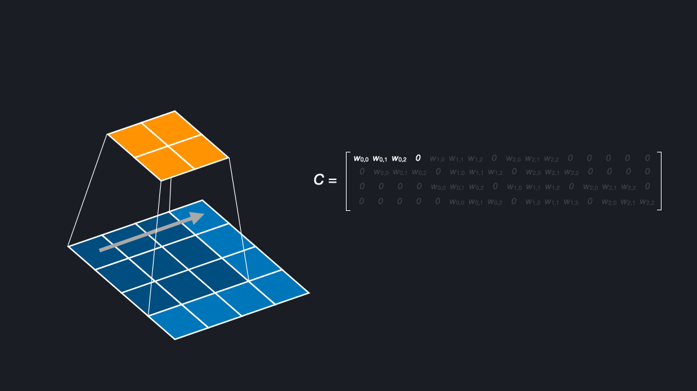
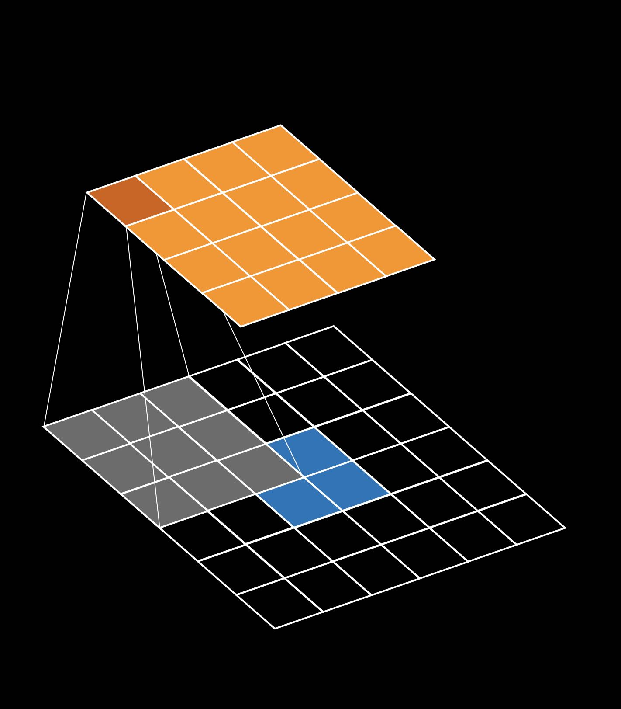
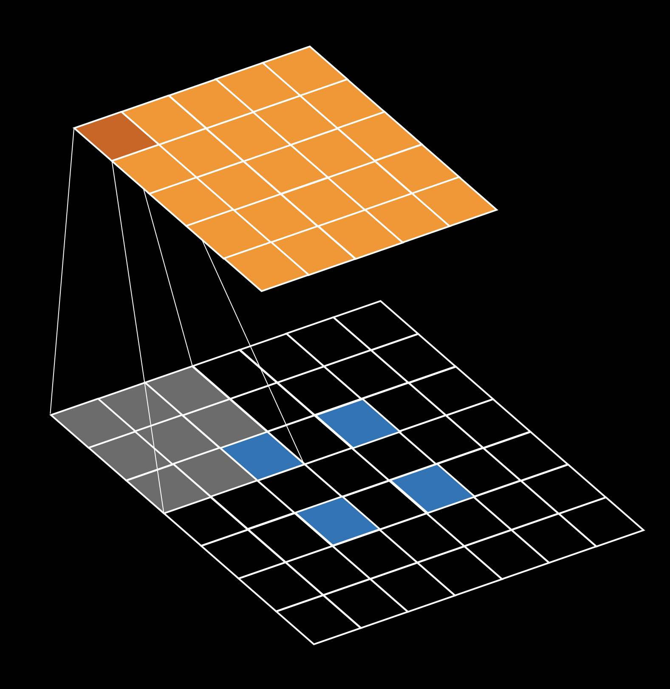

# Deconvolutions, transposed convolutions, fractionally strided convolutions

Deconvolutions where first introduced by [Zeiler et al. (2010)](https://doi.org/10.1109/CVPR.2010.5539957) and are also known under the names *transposed convolutions* and *fractionally strided convolutions*. This repository explores why these names make sense for certain combinations of input/output/kernel sizes and strides. It also shows that every deconvolution can be implemented by padding/upsampling the input and then a direct convolution.

For more details see our [blog post](). The examples and images are inspired by [Dumoulin et al. (2018)](http://arxiv.org/abs/1603.07285).

## Example 1: Direct convolution and back
* Input size: `(4,4)`
* Output size: `(2,2)`
* Kernel size: `(3,3)`
* Stride: `(1,1)`

This example shows how the direct convolution from shape `(4,4)` -> `(2,2)` can be reversed by transposing the matrix which describes this direct convolution. This transposed convolution is then described with the shapes.

* Input size: `(2,2)`
* Output size: `(4,4)`
* Kernel size: `(3,3)`
* Stride: `(1,1)`

## Example 2: Deconvolution as convolution on padded input
* Input size: `(2,2)` / padded to `(6,6)`
* Output size: `(4,4)`
* Kernel size: `(3,3)`
* Stride: `(1,1)`

This example illustrates how the deconvolution `(2,2)` -> `(4,4)` can be expressed as a convolution on a padded (upsampled) input.

## Exampe 3: Fractionally strided convolution as direct convolution
* Input size: `(2,2)` / padded to `(7,7)`
* Output size: `(5,5)`
* Kernel size: `(3,3)`
* Stride: `(1,1)`

To transform an input of shape `(2,2)` into an output of shape `(7,7)` you need a deconvolution with stride $1/2$. That is why this is also called a fractionally strided convolution. This operation can also be implemented as a direct convolution. Here, the input has to be padded between the elements as well as on the border.

## References
Zeiler, Matthew D., Dilip Krishnan, Graham W. Taylor, and Rob Fergus. “Deconvolutional Networks.” In 2010 IEEE Computer Society Conference on Computer Vision and Pattern Recognition, 2528–35. San Francisco, CA, USA: IEEE, 2010. https://doi.org/10.1109/CVPR.2010.5539957.

Dumoulin, Vincent, and Francesco Visin. “A Guide to Convolution Arithmetic for Deep Learning.” ArXiv:1603.07285 [Cs, Stat], January 11, 2018. http://arxiv.org/abs/1603.07285.
